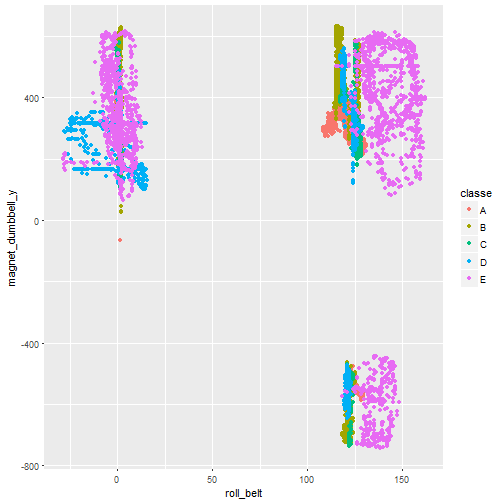
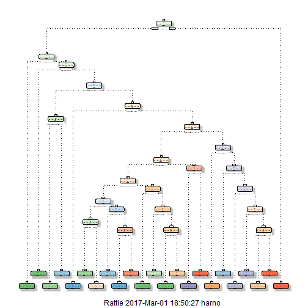

# Peer-graded Assignment : Prediction Assignment Writeup #
# Harnoor Rangi#


## Project Background ##
Using devices such as Jawbone Up, Nike FuelBand, and Fitbit it is now possible to collect a large amount of data about personal activity relatively inexpensively. These type of devices are part of the quantified self movement - a group of enthusiasts who take measurements about themselves regularly to improve their health, to find patterns in their behavior, or because they are tech geeks. One thing that people regularly do is quantify how much of a particular activity they do, but they rarely quantify how well they do it. In this project, your goal will be to use data from accelerometers on the belt, forearm, arm, and dumbell of 6 participants. They were asked to perform barbell lifts correctly and incorrectly in 5 different ways. More information is available from the website here: http://groupware.les.inf.puc-rio.br/har (see the section on the Weight Lifting Exercise Dataset).

## Data sources for the assignment ##

The training data is downloaded from the following link and saved on to the local machine : 

https://d396qusza40orc.cloudfront.net/predmachlearn/pml-training.csv

The test data is downloaded fromthe following link and saved on to the local machine:

https://d396qusza40orc.cloudfront.net/predmachlearn/pml-testing.csv

## Loading data ##

Data files from the above link were downloaded to the local computer and loaded into R using the following code:

```r
train_data <-read.csv("pml-training.csv")
test_data <-read.csv("pml-testing.csv")
```

## Loading required libraries##

```r
library(caret)
```

```
## Warning: package 'caret' was built under R version 3.3.2
```

```
## Loading required package: lattice
```

```
## Loading required package: ggplot2
```

```
## Warning: package 'ggplot2' was built under R version 3.3.2
```

```r
library(rattle)
```

```
## Warning: package 'rattle' was built under R version 3.3.2
```

```
## Rattle: A free graphical interface for data mining with R.
## Version 4.1.0 Copyright (c) 2006-2015 Togaware Pty Ltd.
## Type 'rattle()' to shake, rattle, and roll your data.
```

```r
library(lattice)
library(rpart)
library(rpart.plot)
```

```
## Warning: package 'rpart.plot' was built under R version 3.3.2
```

```r
library(RGtk2)
library(RColorBrewer)
```

```
## Warning: package 'RColorBrewer' was built under R version 3.3.2
```

```r
library(randomForest)
```

```
## Warning: package 'randomForest' was built under R version 3.3.2
```

```
## randomForest 4.6-12
```

```
## Type rfNews() to see new features/changes/bug fixes.
```

```
## 
## Attaching package: 'randomForest'
```

```
## The following object is masked from 'package:ggplot2':
## 
##     margin
```

```r
library(e1071)
```

## Data Cleaning ##
Removing the rows of data containing "NA" and the variables which are useless for prediction from both training and test data sets

```r
set.seed(12345)
unwanted <- names(test_data[,colSums(is.na(test_data)) == 0])[8:59]

train_data <- train_data[,c(unwanted,"classe")]
test_data <- test_data[,c(unwanted,"problem_id")]

dim(train_data)
```

```
## [1] 19622    53
```

```r
dim(test_data)
```

```
## [1] 20 53
```

## Spliting the data as per requirement##
From the training data set creating partitions to create two new data sets 60 % training and 40% testing

```r
part <- createDataPartition(train_data$classe, p = 0.6, list=FALSE)
new_train <- train_data[part,]
new_test <- train_data[-part,]

dim(new_train)
```

```
## [1] 11776    53
```

```r
dim(new_test)
```

```
## [1] 7846   53
```

## Building the model ##

###Creating model using Random Forest first###


```r
modelfit1 <- randomForest(classe~., data=new_train, method='class')
prediction1 <- predict(modelfit1,new_test,type='class')
qplot(roll_belt, magnet_dumbbell_y, colour=classe, data=new_train)
```



```r
x<- confusionMatrix(prediction1,new_test$classe)
x$table
```

```
##           Reference
## Prediction    A    B    C    D    E
##          A 2230    8    0    0    0
##          B    2 1506    4    0    0
##          C    0    4 1364   14    3
##          D    0    0    0 1270    6
##          E    0    0    0    2 1433
```

```r
x$overall[1]
```

```
##  Accuracy 
## 0.9945195
```

Hence, we get 99% accuracy with Random forest method. 

###Creating Decision tree model### 

```r
modelfit2<- rpart(classe ~ .,data=new_train, method='class')
fancyRpartPlot(modelfit2)
```

```
## Warning: labs do not fit even at cex 0.15, there may be some overplotting
```



```r
prediction2 = predict(modelfit2,new_test,type='class')
y<-confusionMatrix(prediction2,new_test$classe)
y$table
```

```
##           Reference
## Prediction    A    B    C    D    E
##          A 1879  260   30   69   66
##          B   56  759   88   34   54
##          C  105  340 1226  354  234
##          D  155  132   23  807   57
##          E   37   27    1   22 1031
```

```r
y$overall[1]
```

```
##  Accuracy 
## 0.7267397
```

## Cleary, Random Forest has more accuracy of 99%##

## Using Random forest to predict the test data set ##

```r
predictiontest <- predict(modelfit1,test_data,type='class')
predictiontest
```

```
##  1  2  3  4  5  6  7  8  9 10 11 12 13 14 15 16 17 18 19 20 
##  B  A  B  A  A  E  D  B  A  A  B  C  B  A  E  E  A  B  B  B 
## Levels: A B C D E
```

